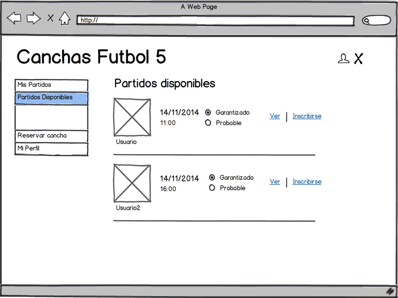

Taller 2: Aplicativo Web Canchas - Futbol 5
===========================================

== Enunciado ==

El caso se basará del mismo enunciado que se dió en el Taller 1, caso *Fútbol 5*.

En esta oportunidad, se hará ciertas modificaciones por lo que se sugiere prestarle
atención a las <<historias-usuario, historias de usuario>> (requerimientos del sistema).

En las <<historias-usuario, historias de usuario>> se le presentarán _wireframes_
(http://es.wikipedia.org/wiki/Wireframe_(Dise%C3%B1o_web)) que ustede deberá de implementar.
Es factible que el _look & feel_ sea ligeramente distinto, pero la historia deberá
cumplir con la funcionalidad especificada.

== Objetivo ==

Desarrollar un aplicativo web utilizando las tecnologías aprendidas en clase.
Deberá implementar la aplicación utilizando:

* Java EE
* Base de datos Mongodb o Postgresql (a elección del grupo).
* En caso de utilizar una base de datos Postgresql, deberá hacerlo utilizando JPA.
* Toda notificación debe de realizarse mediante correo electrónico.
* Deberá la aplicación estar subida en el PaaS Heroku y poder ser accedida desde
Internet.

[[historias-usuario]]
== Historias de Usuario ==

=== El usuario deberá poder loguearse en la aplicación utilizando una cuenta de Facebook ===

Al loguearse *por primera vez*, sus datos de este (correo electrónico, nombre, fbid)
deberá de guardarse en la base de datos.

[[principal]]
.Pantalla Inicial

=== Luego de loguearse, el usuario deberá poder ver los partidos que administra. ===

Estos se mostrarán como una lista.

* Al hacer click en el enlace de "Ver" se pasará a la siguiente <<ver-datos-partido,historia>>.
* Al hacer click en el enlace de "Iniciar" se cerrará las inscripciones y se iniciará
  el partido. Si faltan jugadores, se tomarán los que están como "Probables". El sistema deberá
  de proceder a la asignación automática de equipos. Además, se deberá notificarse a las personas
que han sido aceptadas en el partido así como a las que no consiguieron cupo.
* Al hacer click en el enlace de "Cancelar" se cancelará el partido, notificando
por correo a todas las personas que estaban inscritas.

[[partidos-administrados]]
.Lista de partidos administrados

[[ver-datos-partido]]
=== El usuario podrá ver y editar los datos del partido que ha creado y no se ha iniciado ===

Se mostrarán los datos de la reserva de partido (como la fecha, hora y la cancha). Estos datos
no serán editables.

Además, se listará la alineación del equipo que tendrá el nombre y un _coeficiente
 de partidos ganados_. Este indicador mostrará la fracción de partidos ganados en
 relación a los jugador por el jugador.

Por cada jugador, se le deberá asignar un equipo. En caso de no hacerlo, la aplicación
deberá de asignarle automaticamente un equipo, tomando en cuenta la igualdad numérica.

* Al hacer click en el botón "Guardar", se procederá a guardar los datos del partido.
* Al hacer click en el botón "Iniciar", se procederá a iniciar el partido, siguiendo
las reglas de la historia anterior.

[[partidos-administrados-ver]]
.Ver / editar detalle de partido creado

[[partidos-administrador-ver-iniciado]]
=== El usuario podrá ver el detalle de un partido ya iniciado y guardar el marcador ===

El usuario deberá ver la información de un partido (fecha, cancha y alineaciones), pero
además deberá de poder ingresar el resultado del partido, y guardarlo.

[[img-partidos-administrados-ver-iniciado]]
.Ver / editar detalle de partido creado

=== El usuario podrá ver el listado de partidos en los que participará ===

Se mostrará el listado ordenada por fecha. Además, cada partido tendrá dos opciones:

* Ver alineaciones, que pasará a la historia <<partidos-participante-ver, Ver alineación de partido >>.
* Salir, que pasará a la historia <<usuario-desuscribir, Salir de partido>>.

[[partidos-participante]]
.Listado de partidos en los que el usuario participa

[[partidos-participante-ver]]
=== El usuario podrá ver las alineaciones del partido en el que se ha inscrito (No iniciado) ===

[[img-partidos-participante-ver-no-iniciado]]
.Ver detalle de partido creado, con las alineaciones

[[usuario-desuscribir]]
=== El usuario saldrá de un partido que está inscrito (desuscribir) ===

Al salir de un partido inscrito, deberá notificársele al administrador via correo
electrónico.

=== El usuario podrá visualizar los partidos disponibles donde puede inscribirse ===

Se mostrará un listado de los partidos creados (y no iniciados) por todos los usuarios de la aplicación.

Los datos a mostrar por partido serán:

* La imagen de perfil de facebook del usuario que creó el partido.
* La fecha y hora del partido.
* Dos radio-buttons en las que se pueda seleccionar si se quiere inscribir como
"Garantizado" o como "Probable".
* Enlace "Ver" que muestra la historia <>.
* Enlace "Inscribirse" que procede a inscribir al usuario en el partido elegido.

[[img-partidos-disponibles]]
.Ver listado de partido en los que el usuario podrá registrarse

=== El usuario podrá reserver una cancha (crear un partido) ===

En un principio, el usuario seleccionará una fecha y según esta, se mostrará el listado
de canchas disponibles.

Además, se mostrará un _textarea_ donde se ingresarán los correos de las personas
que se desea invitar al partido. Estos correos deben de estar separados por una coma.

Al hacer click en el botón "Reservar", se deberá de crear un partido y enviar correo
a todos los invitados.

[[img-reservar-cancha]]
.Reservar cancha (crear partido)

=== El usuario podrá ver los datos de su perfil ===

Al hacer click al menú "Mi Perfil" o al ícono de una persona (en la parte superior
derecha), deberá de mostrarse los datos del usuario. Estos datos son los siguientes:

* La foto de perfil de facebook
* El nombre de facebook
* Un gráfico que muestra el _coeficiente de partidos ganados_ contra el _coeficiente
de partidos perdidos o empatados_. La suma de estos dos deberían dar 1.

[[img-mi-perfil]]
.Mi perfil

=== Cerrar sesión ===

Al hacer click en la "X" de la parte superior derecha de la pantalla, deberá de
cerrar sesión.

=== API REST para aplicativo móvil ===

La aplicación deberá implementar la siguiente interface HTTP Rest. Este servicio
devolverá en formato JSON los jugadores y su _coeficiente ganador_. Este listado
debe de estar ordena en forma descendente según el coeficiente.

*Request GET*

No se envía ningún dato.

*Response*

[source,json]
.Response
----
[
  {
    "nombre" : "Juan Perez",
    "coeficiente_ganador" : 0.76
  },
  {
    "nombre" : "Luis Lopez",
    "coeficiente_ganador" : 0.23
  }
]
----

== Organización ==

El taller tendrá lugar durante las sesiones de clase de la semana 14 y semana 15,
periodo en el cual debe terminarse la implementación del caso. Adicionalmente en
la última sesión se debe exponer el proyecto a todo el salón.

Este taller se desarrollará bajo el esquema de “Hackathon” cuyo objetivo es
implementar el proyecto aplicando los conocimientos adquiridos, investigar,
aprender colaborativamente y aportar las habilidades de cada integrante en el
logro del objetivo.

Los alumnos se organizarán en grupos de 6 como máximo. Cada fila del laboratorio
será considerada un grupo. Los grupos nombrarán a un coordinador y se organizarán
internamente de la forma que consideren conveniente.

== Calificación ==

La asistencia durante esta semana es obligatoria. Las inasistencias serán penalizadas a criterio del docente.

La calificación no busca la perfección del sistema desarrollado, pero sí desea determinar cuáles de los grupos se aproximan más a la solución completa (funcionalidad correctamente ejecutada sin errores en tiempo de ejecución), así como quiénes emplean de manera más ágil y completa las tecnologías aprendidas en clase (diagramas explicativos acerca del cómo se implementó la solución).

|===
|Descripción |Puntaje |Criterios

|Cumplimiento de historias de usuario
|0 a 15 puntos
|Utilización de tecnologias aprendidas en clase, cantidad de historias terminadas.
y el Look & feel de la aplicación. Esta nota es *grupal*.

|Apreciación
|0 a 5 puntos
| Se medirá la dedicación que el alumno le da al proyecto en clase. Esta nota es
*personal*.
|===

== Referencias ==

* PaaS Heroku con Java (https://devcenter.heroku.com/articles/war-deployment)
* Base de datos Postgresql (http://www.postgresql.org.es/)
* Base de datos Mongodb en la nube (https://mongolab.com/)
* Base de datos Postgresl con Heroku (https://www.heroku.com/postgres)
* Bootstrap (http://getbootstrap.com/)
* JQuery (http://jquery.com/)
* Para hacer un login con Facebook:
** http://facebook4j.org/en/index.html
* Para hacer gráfico pie (_pie chart_):
** http://ksesocss.blogspot.com/2013/02/grafico-circular-css.html
** http://www.kabytes.com/programacion/graficos-circulares-pie-charts-svg/
** https://developers.google.com/chart/interactive/docs/gallery/piechart
